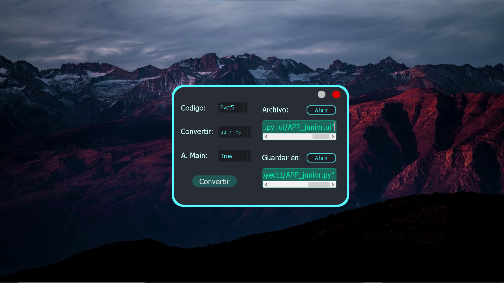

# PyQt5-ArchConverter
Project #2 with Python-PyQt5. A simple tool for
convert .ui files to .py and also .qrc to .py.

main file __main__.pyw, when running this file
displays the available options shown in this
program.

It is important to know that basic knowledge is needed
in python and in the creation of pc applications with python
using pyqt or pyside libraries, in order to adapt the
I code this with the aim of leaving the program running
in new updates.

**Picture 1**

<i>Best respect !!!</i>

**<cite>Author: Francisco Velez</cite>**